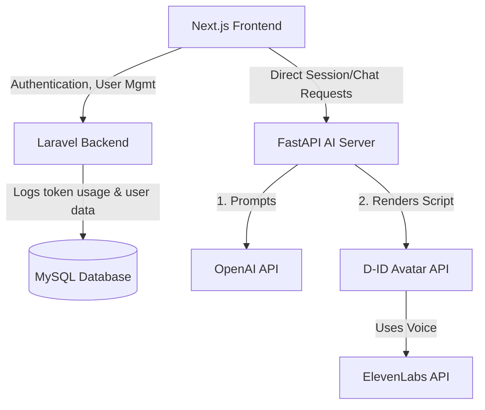

# System Architecture & Dependency Graph

This document details the system architecture of the AI Video Chat Platform, outlining how the frontend, backend, and AI service interact.

---

## 1. High-Level Architecture Diagram



---

## 2. Component Directory

### Frontend (Next.js)
- **Role**: Client application, user dashboard, admin dashboard, and the realtime chatroom interface.
- **Tech Stack**: React 19, Next.js 16, TailwindCSS 4.
- **Critical Flow**: Plays the welcome video, records user chat messages, requests video generation from FastAPI, and overlays the generated talking head video.

### Backend (Laravel)
- **Role**: User signups/logins, OTP password resets, administrative control (role assignment, viewing user lists, logging usage history).
- **Tech Stack**: PHP 8.2, Laravel 12, MySQL, Spatie Permission, Firebase JWT.
- **Critical Flow**: Verifies JWT tokens via middleware and writes OpenAI token usage logs into MySQL database.

### AI Service (FastAPI)
- **Role**: Orchestrates OpenAI GPT, ElevenLabs text-to-speech, and D-ID video generation.
- **Tech Stack**: Python 3.10+, FastAPI, Uvicorn, OpenAI SDK.
- **Critical Flow**: Receives chat input, sends prompt to `gpt-4o-mini`, calls D-ID talks API using ElevenLabs integration, polls until the video is rendered, and returns the video URL.

---

## 3. Deployment Network Flow (Reverse Proxy)

To run the application in a unified Docker stack, we employ a Nginx container configured as a reverse proxy:

```
[User Request] 
      │
      ▼
┌──────────────┐
│  Nginx (80)  │
└──────┬───────┘
       ├───────► /api/session/create, /api/chat ───► [FastAPI (8000)]
       ├───────► /api/* (Auth, Users list) ────────► [Laravel (8080)]
       └───────► /* (Static / Next.js) ───────────► [Next.js (3000)]
```
This design resolves all CORS issues and removes hardcoded ports from the client codebase.
